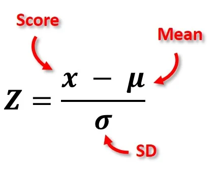

# Sample Problem Solving in Central Limit Theorem (CLT)

- **Problem 1:
A population has a mean (μ) of 70 and a standard deviation (σ) of 15. A sample of size 50 is
taken from this population.**
  - a) What is the expected mean and standard deviation of the sampling distribution of the sample mean?
  - b) What is the probability that the sample mean is greater than 74? Assume the
sample means are normally distributed.

- Solution:
Part (a): Expected Mean and Standard Deviation of the Sampling Distribution
- Expected Mean of the Sampling Distribution:
According to the Central Limit Theorem, the expected mean ( μx̄) of the sampling
distribution of the sample mean is equal to the mean of the population (μ):

- Standard Deviation of the Sampling Distribution (Standard Error): The standard
deviation of the sampling distribution of the sample mean, also known as the
standard error μx̄ , is given by:

- 

- Where:
  - σ is the population standard deviation.
  - n is the sample size.

- Plugging in the values:
  - So, the standard deviation (standard error) of the sampling distribution is:
  - approximately 2.12.
- Part (b): Probability that the Sample Mean is Greater than 74

- Step 1. Find the Z-score
The Z-score for the sample mean can be calculated using the formula:

  - 

  - Where:
  - X is the sample mean (74 in this case).
  - μx̄ is the mean of the sampling distribution (70).
  - o is the standard deviation of the sampling distribution (2.12).

- Plugging in the values:

  - 

  - Step 2. Find the Probability
    - The probability that the sample mean is greater than 74 is the area under the standard normal curve to the right of the Z-score 1.89.
    - Using a standard normal distribution table or a calculator, the probability
corresponding to a Z-score of 1.89 is approximately 0.9706.
    - Therefore, the probability to the right of this Z-score is:
    - P(X̅>74)=1−0.9706=0.0294

- Conclusion:
The probability that the sample mean is greater than 74 is approximately 0.0294 or
2.94%
